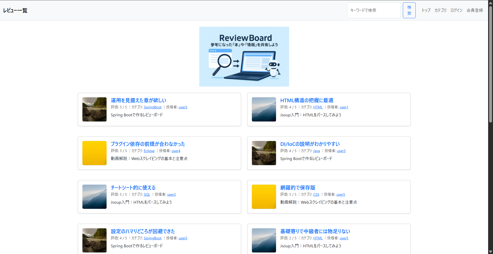
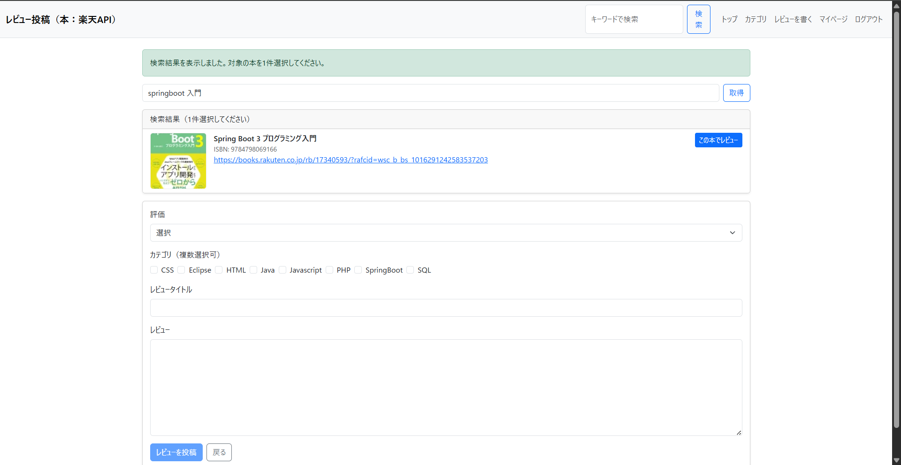
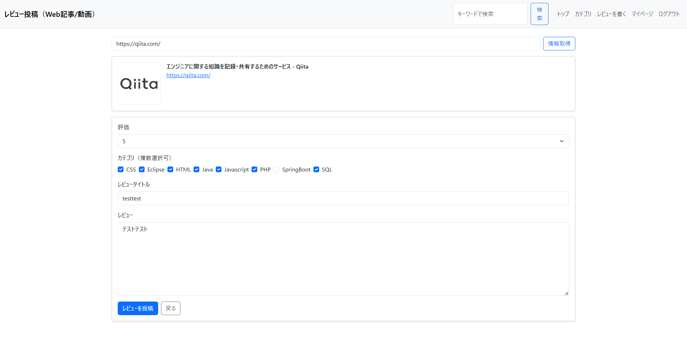
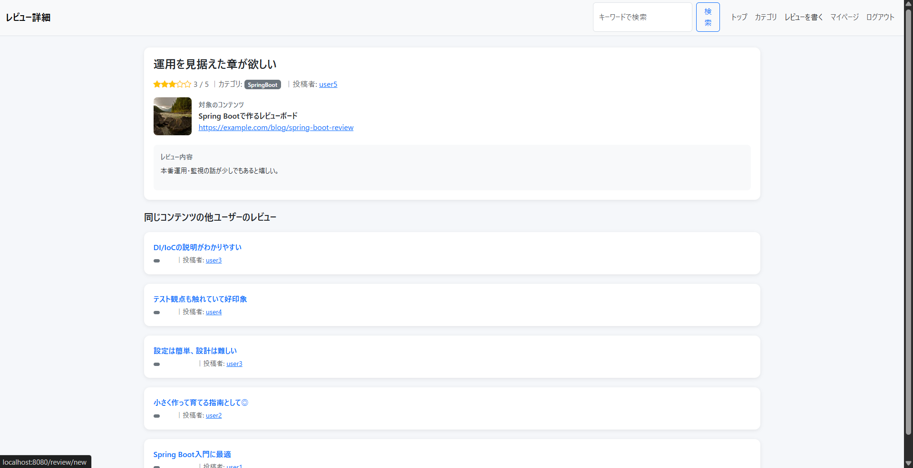
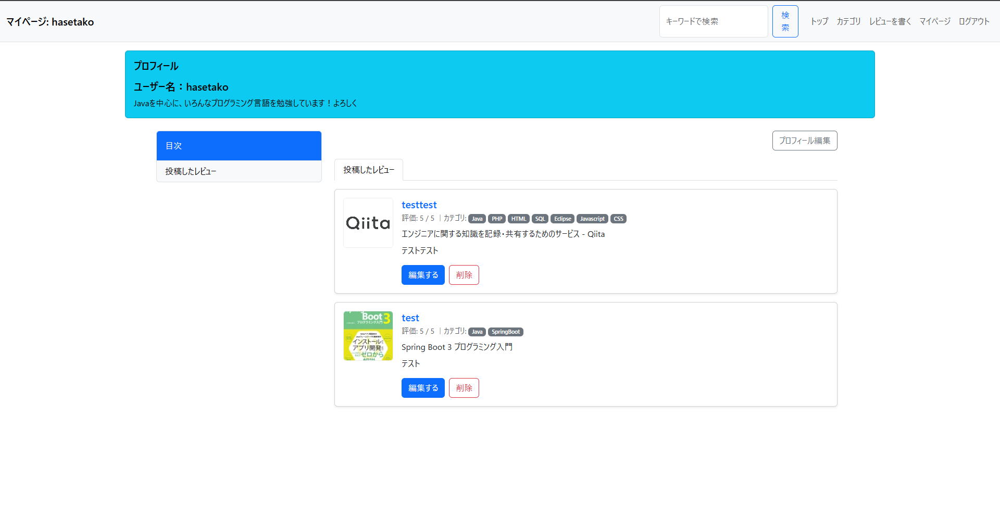
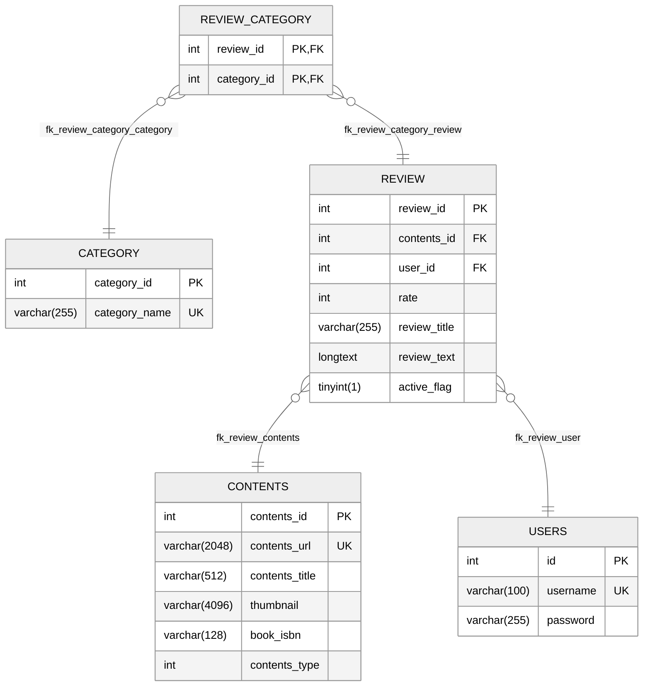

# Review Board

職業訓練校でのグループワークで制作しました。
外部コンテンツ（Web記事 / 動画 / 書籍）に対してレビューを投稿・閲覧できる Web アプリケーションです。  
Jsoup を使った URL メタ情報取得と、楽天 Books API を使った書籍検索機能を備えています。
私は主にテーブル設計、Jsoup/楽天BooksAPIを用いてレビュー情報とコンテンツのメタ情報を紐づける部分の実装を担当しました。

---

## 1. 概要

- Web記事 / 動画などの URL を入力してレビューを投稿
- 楽天 Books API を使って書籍を検索 → 選択 → レビュー投稿
- レビューには複数カテゴリ（タグ）を付与可能
- ユーザーごとのマイページ機能（自分のレビュー一覧）
- シンプルな UI（Thymeleaf + Bootstrap）


---

## 2. 主要機能

### 2-1. Web記事 / 動画レビュー（Jsoup）

- ユーザーが URL を入力して送信
- Jsoup で対象ページにアクセスし、以下の情報を取得してプレビュー表示
  - 最終到達 URL（リダイレクト後）
  - タイトル（`og:title` → なければ `<title>`）
  - サムネイル画像（`og:image`）
- 正規化・サニタイズした上で DB の `contents` テーブルに保存

### 2-2. 書籍レビュー（楽天 Books API）

- 本のタイトルで楽天 Books API を検索
- 検索結果から 1 件選択してプレビュー表示
- ISBN / サムネイル / 商品ページ URL を `contents` に保存
- レビュー本文・評価値・カテゴリを入力して投稿

### 2-3. レビュー / カテゴリ

- レビューに対して複数カテゴリ（タグ）を付与可能
- レビューとカテゴリは中間テーブル `review_category` で多対多
- カテゴリ別のレビュー一覧ページを提供

### 2-4. ユーザー / マイページ

- ログインユーザーのみレビュー投稿可能
- マイページで自分の投稿したレビューを一覧表示
- レビューの編集 / 論理削除（`active_flag`）対応

### 2-5. 画面イメージ

#### トップページ(レビュー一覧)


#### レビュー投稿画面(本/本以外のコンテンツ)
##### 本(楽天BooksAPI)


##### 本以外のコンテンツ(Jsoup)

#### レビュー詳細画面

#### マイページ画面


- ※実際の動作デモをご希望の場合は、ローカル環境＋トンネル（ngrok）で共有可能です
---

## 3. 技術スタック

- 言語
  - Java 21
- フレームワーク / ライブラリ
  - Spring Boot 3.5.6
  - Spring Web / Spring Data JPA
  - Thymeleaf
  - Jsoup
- データベース
  - MariaDB 12.0
- フロントエンド
  - Bootstrap 5.3.3
- ビルドツール
  - Maven
- 外部API
    - 楽天BooksAPI


---

## 4. 環境構成

### 4-1. 必須環境

- JDK 21
- Maven
- MariaDB（ローカルホストで動作）
- Git


### 4-2. データベース

#### ER図



デフォルトでは以下の接続設定を想定している：

```properties
spring.datasource.url=jdbc:mariadb://localhost:3306/reviewboard_test?useSSL=false&serverTimezone=Asia/Tokyo
spring.datasource.username=root
spring.datasource.password=${DB_PASSWORD:}
```

## 5. 今後の改善点
- Spring Security 導入による認証・認可の整理
- レビューへのコメント機能
- ページネーション
- 検索機能の強化(ユーザー名、コンテンツ名等)
- リファクタリング
    - バリデーションコードの重複
    - Contents重複チェックのセクションのservice化
    - フロントエンドの共通レイアウトの整理

## 6. クレジット
- [Supported by Rakuten Developers](https://developers.rakuten.com/)


